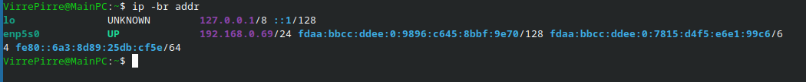
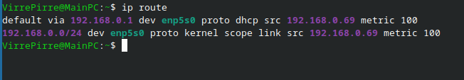
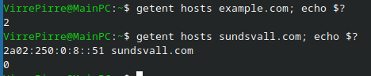
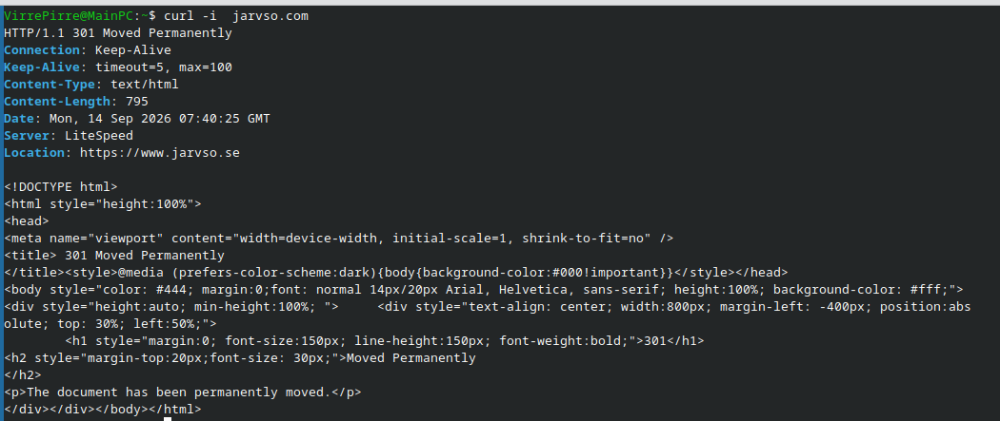

## ip addr med -br ger oss:

utdatan berättar IP addressen som är kopplad till nätverksgränssnittet.  -br tillägget står för brief och gör det vanliga utdatan från ip kommandot mycket mer konsis.

## ip route är del av samma paket som ip addr men ger oss:

 ip route visar rutten som paket tar, om det är till en webbserver på internet eller andra klienter på nätverket, samt genom vilket nätverksgränssnitt som klienten använder för det.
 ip route ger inte mycket annan information än standardrutten som klienten är kopplad till, så allt bortom standardrutten är utanför detta kommands tillämpningsområde.
## getent hosts example.com ger oss 

beroende på om domänen man anger kunde lösas så får vi IP adressen till domänen vi angav, eftersom example.com inte kunde lösas får vi en exit code på 2, medans google.com kunde lösas och ger oss addressen och en exit code på 0.

## curl -i example.com ger oss

curl med tillägget -i ger oss istället för bara html även response headers, så som server namn, uppkopplingstyp och annat, curl -i ger oss dock ingen information om IP-adresser, eller ruttar till webbplatsen.

vald interface : enp5s0

