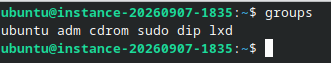
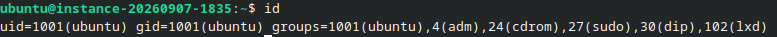
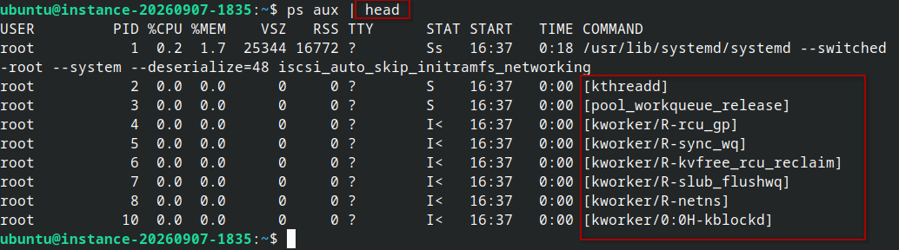
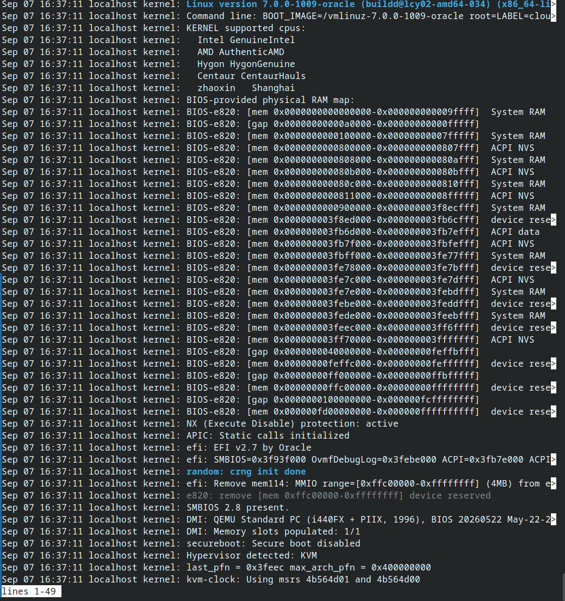
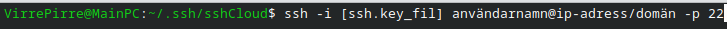
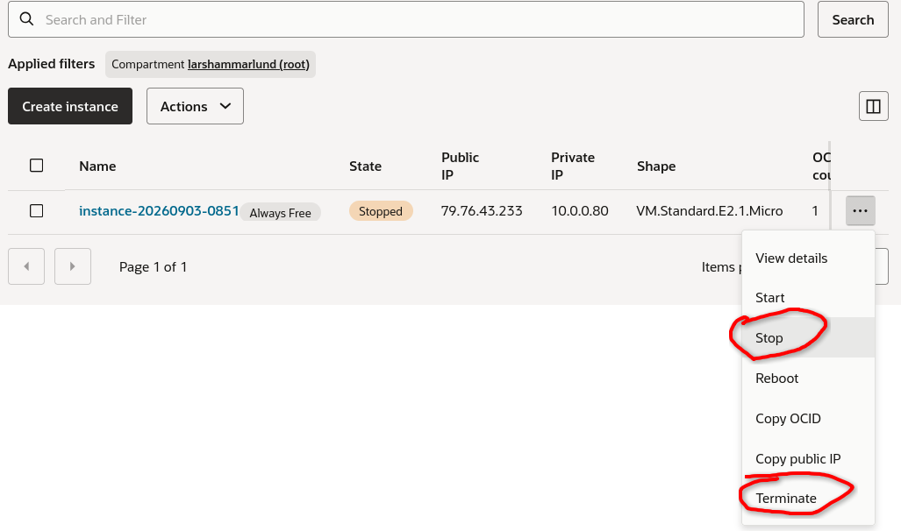
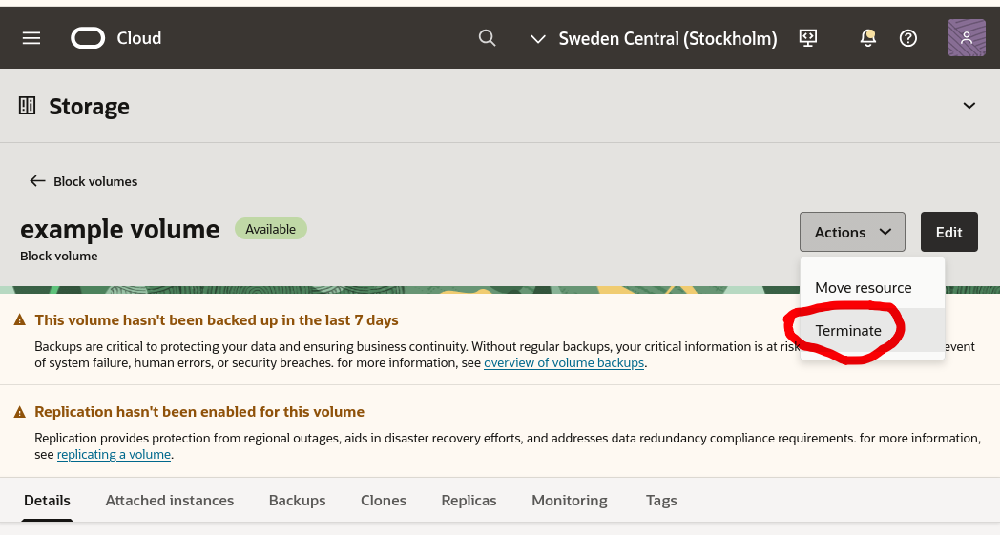
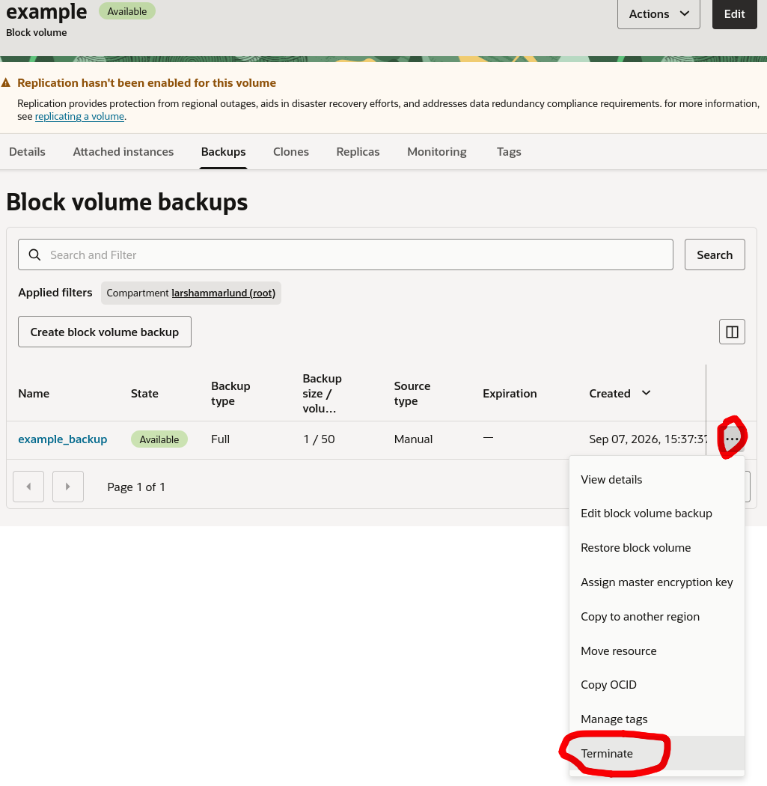
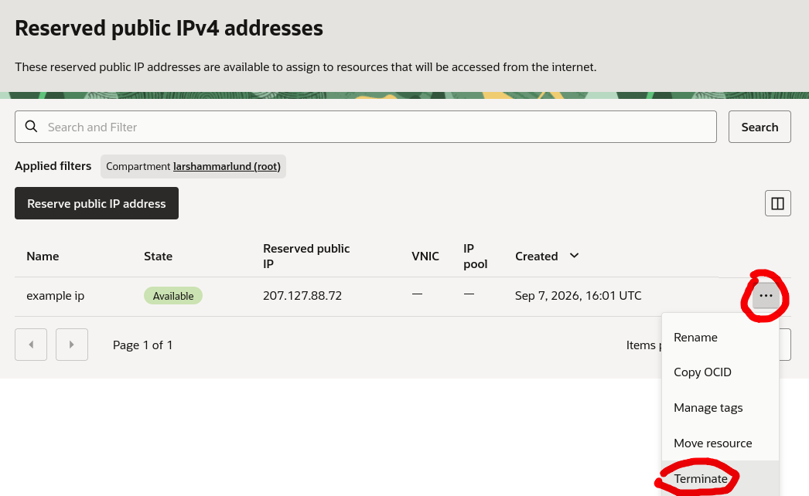

# Week 36 OCI Cloud Security Lab

## MILJÖ
- Oracle Cloud
- OS : Linux : Ubuntu : 26.04
- public ip 79.76.53.124
- IMAGE : Canonical-Ubuntu-26.04-2026.08.17-0
- INLOGGNING : SSH : KEYPAIR
## Del 3 – Logga in med SSH

- Whoami visar  "ubuntu".
- Hostname visar eller sätter host name "instance-20260903-0851"
- pwd visar /home/ubuntu.
- uname med option -a. "Linux instance-20260903-0851 7.0.0-1009-oracle #9-Ubuntu SMP PREEMPT Thu Jul 23 02:43:14 UTC 2026 x86_64 GNU/Linux"
- uptime skriver ut 09h:54m:32s

## Kontroll 1 – Identitet och behörigheter

- whoami visar användaren som är inloggad : "ubuntu"

- Groups visar specifierad användar gruppmedlemskap.

- id  visar userid(UID) och groupid(GID) för varje specifierad användare och deras gruppmedlemskaper
  

## Kontroll 2 – Filrättigheter

### Innan

Läs och skriv rättigheter för ägare och gruppen, kan läsas av övriga användare

### Efter

Läs och skriv rättigheter enbart för ägaren, gruppmedlemar och övriga användare har ingen rätt till att läsa,skriva eller exekvera.

## Kontroll 3 – Systemuppdateringar

Uppdateringar är väsentliga för att förebygga risker med äldre mjukvara som kan ha sårbarheter.
Systemets integritet gynnas särskilt genom att uppdatera, men även konfidentialiteten och tillgängligheten, beroende på vad sårbarheten kan ha för effekt.

## Kontroll 4 – Processer

ps med tillägget 'aux' skriver ut alla processer som pågår på systemet, men genom att 'pipea' outputen till head så får vi istället dem 10 första artiklarna på listan.

i rutan till höger syns de processer som körs i bakrunden.
processerna som tar mest plats är dem vid namner 'kworker' och står för kernel worker, och är namnet på processer som gör jobb åt linux kärnan.
kworkers jobbar i bakrunden, och hanterar t.ex I/O requests, power states och skrivning till disk.

oväntade processer tar systemresurser och kan ha varierad påverkan hos prestandan.

## Kontroll 5 – Loggar

Journalctl möjligör effektiv felsökning på systemproblem, och övervakning av systemaktivitet, fördelsaktigt för systemadministratörer och utvecklare
En av de mest kraftfulla funktionerna i journalctl är dess förmåga att filtrera loggar baserat på olika kriterier.

## Kontroll 6 – SSH

Inloggning till Cloud-instans eller annan virtuel maskin sker så:

SSH står för SecureSHell och används för krypterad uppkoppling mellan maskiner.
SSH kan ha slutat fungera av olika anledningar

- Maskinen kan inte nås på grund av avbruten nätverks uppkoppling:
   
    fix: säkerställ att maskinen har stabil nätverksuppkoppling antingen bundet eller obundet, kontrollera genom att testa om datorn kan nå internet.
- Maskinen är inte längre igång
   
    fix: Om du har tillgång till maskingen i detta fall så säkerställer du att maskinen har stabil strömförsörjning och slå på, om det är en molntjänst kollar du webbkontrollpanelen och löser därifrån, alternativ kontakta support.
- Autentiserings- och behörighetsfel.
   
    fix: Säkerställ filbehörighet till ssh-nycklarna, referenserna till nycklarna är korrekt(använd rätt path), eller begär ny ssh-nyckel.
- Tidsuttag och långsam respons
   
    fix: nätverk eller brandväggs problem, prova pinga systemet, kolla om brandväggen är öppen på port 22, alternativt kontrollera nätverkstatus för överbelastning eller andra nätverksfel.

## 1. Min OCI-miljö/Min lokala Linux-miljö/Min lokala WSL-miljö
- Tenancy (N/A):
- Compartment (Endast OCI): larshammarlund (root)
- Region (Endast OCI): eu-stockholm-1
- Availability Domain (Endast OCI): AD-1
- VM-namn/hostnamn/WSL-maskinnamn: instance-20260902-1210
- Operativsystem: Canonical Ubuntu 26.04
- Shape (Hårdvara, gäller alla): VM.Standard.E2.1.Micro | OCPU count 1 | Network bandwidth 0.48 | Memory 1GB | 50GB Storage
- Inloggningsmetod: SSH med key pair.
---
## 2. Linux-kommandon

- ls -la :

Skriver ut en lista av alla filer incl osynsliga filer till terminalen.
Hotaktör kan en snabb få överblick för vad dem kan göra på systemet
ls -la ger en aktör överblick på rättigheter och ser hemliga filer, koppling till Konfidentialitet  
- whoami :

skriver ut användarnamner på användaren som är inloggad.
snabb blick på vad kontot kan ha för behörigheter.
Hotaktören får snabb koll på vilket konto dem har loggat in med och vad dem kan ha för behörgheter påverkar konfidentialitet
- date   :

visar eller sätter systemets datum och tid. 
date ger systemets adminaströr möjlighet att kolla datum i olika format och kolla framtida datum med enkla options, date har även stor nytta i många fall i skripting.
Systemets datum och tid kan blir nyttjade av bakrundsprocesser för automatisering, har en hotaktör möjlighet att göra ändringar i datum och tid så hotas integriteten.
- id     : 

visar användare och grupp information för varje specifierad användare eller nuvarande användare.
Kan ge en hotaktör information om specifika användare som finns och vilka grupper dem tillhör för att veta vilka konton dem kan sikta på, konfidentialiteten utsätts för aktören får tillgång till lista av användaren och deras gruppmedlemskap.
- groups :

skriver ut grupp medlemskap för specifierad användare eller den som är inloggad.
Det betyder att du vet vilken grupp du tillhör och vad du har behörighet till.
Grupper är oerhört viktigt för att se till att personer på samma system bara har tillgång till det dom behöver, genom att tilldela grupper så har inte alla möjlighet att läsa, skriva och exekvera vad dem vill, och att rätt person har tillgång till det dem behöver när dem behöver det.
Grupper stärker ett systems konfidentialitet, integritet och tillgänglighet.

## 3. Hardening
| Kontroll | Risk | Vad gjorde jag? | Hur verifierade jag? | CIA |
|-----------|-----------|-----------|-----------|-----------|
| Filrättigheter  | obehöriga har tillgång | applicerade filrättigheter till känsliga kataloger  | ls -l visar en överblickande vy av filer och vem som har tillgång  | Filrättigheter upprätthåller konfidentialitet och integritet, rätt person har rätt att skriva,läsa och exekvera |
| Systemupdateringar  | Mjukvara med kända sårbarheter blir utnyttjade.  | Aktivera automatiska uppdateringar eller gör rutinerade systemuppdateringar.  | kontrollera om det finns updateringar finns tillgängliga, apt list --upgradable, olika beroende på distribution | Ett uppdaterat system med uppdaterad mjukvara förstärker integriteten och skyddar mot hot som utnyttjar kända sårbarheter.  |
| ssh | Okrypterad uppkoppling riskerar avlyssning eller möjlig  man in the middle attack.  | Använder ssh för säker och kryperad kommunikation mellan olika system  | En lyckad SSH uppkoppling kännetecknas genom status medelande i terminalen.  | Genom att använda en krypterad uppkoppling så minimerar man risken för avlyssning eller man in the middle attacker, ökad konfidentialitet och integritet.  |
| värdbaserad brandvägg | ökad risk för malware infektion  | installera ufw och sätt upp restriktioner.  | kontrollera med systemclt status verbose för att få överblick över status, policys och synliga regler.  | En brandvägg gör mycket för ditt system, det håller objudna aktörer ute och stärker sytemets integritet oerhört.  |

---
## 4. Recovery-plan
### Vad kan gå fel?
Kan inte komma åt server med ssh
### Hur upptäcker jag problemet?
Försöker logga in med ssh och ssh.key pair
### Vad kontrollerar jag först?
Att servern är uppe antingen genom att pinga eller kontrollera att instansen rapporterar "Running".
### Hur återställer jag åtkomst?
Kontrollera ssh porten och återställ, pröva igen
### När behöver jag hjälp?
Om jag inte kan interagera med servern fysiskt eller den virtuella Cloud panelen, eller om mjukvaru brandvägger blockerar ssh kommunikation.

---
## 5. Backup
### Vad har jag sparat?
klon av instansen för rollback, med allt arbete
### Vad finns i GitHub?
Documentering över server konfiguration, samt övriga markdownfiler
### Vad kan återskapas?
vid rollback som återgått till gammal konfiguration kan man konsultera konfiguration ducumenten som finns på GitHub och arbete kan upptas igen.
### Vad går inte att återskapa?
Odocumenterade konfigurationer och arbete som inte sparat och pushat till GitHub.

---
## 6. Cleanup
### VM-instans
Compute > Instances

### Diskar
Storage > Block Volumes

### Backuper
Storagre > Blockvolume > [select volume] > backups

### Publika IP-adresser
Networking > Reserved public IPs

### GitHub-evidens

---
## 7. CIA-reflektion
### Konfidentialitet
Rätt person har åtkomst till maskinen, SSH används med ett key-pair för att säkerställa att bara rätt personer ska ha tillgång till moln instansen.
### Integritet
Informationen finns när det behövs och att skulle något hända eller förstöras så finns en backup att falla tillbaka på, kritiskt men inte hemligt arbete kan sparas till GitHub.
### Tillgänglighet
Servern eller maskinen är tillgängling när du behöver den, brandvägg rätt konfigurerad och du når med ssh. 

---
## 8. Reflektion
### Vad fungerade bra?
skapa moln instans, ssh:a till instansen, interagera och göra rollback med skapad backup.
### Vad var svårt?
att göra anknytningar till CIA-triaden
### Vad lärde jag mig?
lärde mig skapa virtualla maskinen i molnet. 

