# Network traffic investigation

## Miljö & Metod

- Lokal Linux | Fedora Linux 44 (KDE Plasma Desktop Edition) x86_64
- Kernel :  Linux 7.1.13-200.fc44.x86_64
- Interface använt : enp5s0 
- Under följande investigation kommer jag använda mig av egen fångst mot 
- traffic genererats med hjälp av traffic-mix.sh 
- Pcap filer har genererats av tcpdump och sedan används i wireshark.
-  sanering gjordes genom att censorera synliga IP-adresser, MAC adresser och okryperad information.
- tcpdump kördes samlade trafik under begränsad tid för att förhindra ett rörit trafikflöde

## Paketets väg
_Illustration över hur dns förfrågningar går till_

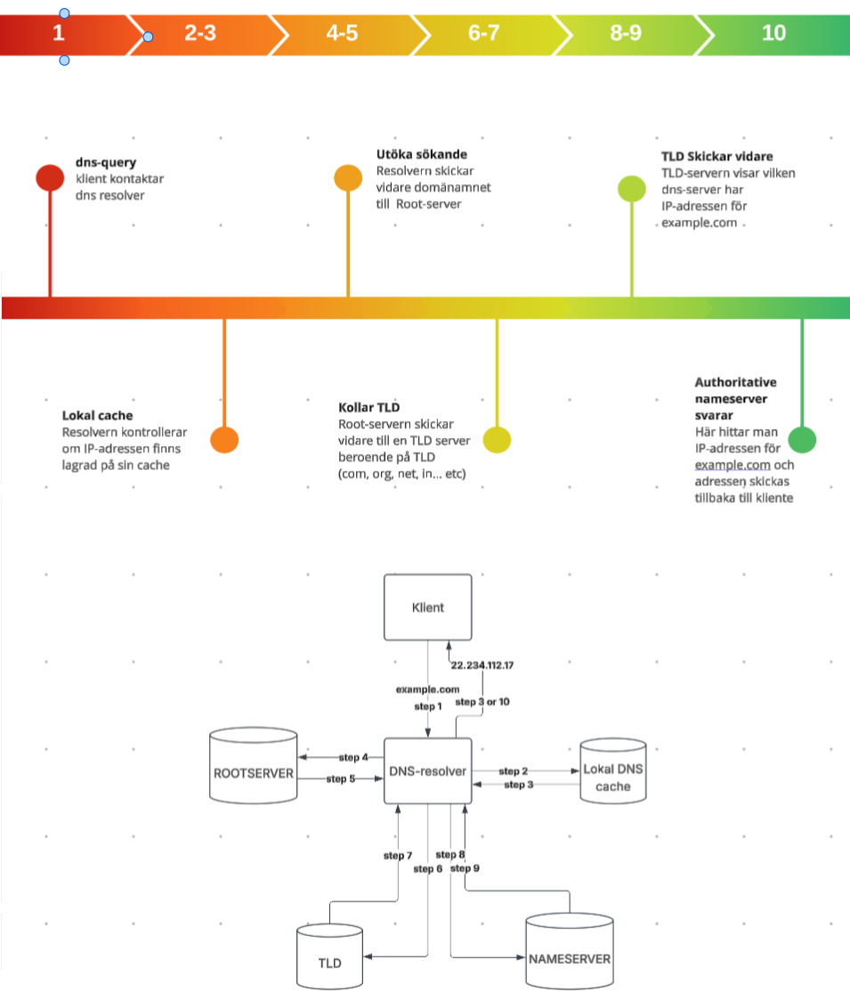

Ett DNS flöde börjar från klienten.

1. DNS-frågan skickas av applikationen och kapslas in i UDP (eller TCP), IP och Ethernet.
2. Förfrågan bärs vidare baserat på default route
3. Paketet lämnar det lokala nätverksgränssnittet med klientens privata IP-adress som källadress.
4. Gatewayn utför NAT/PAT och ersätter den privata källadressen med den publika adressen.
5. Brandväggen i gatewayn kan fatta beslut om att tillåta eller blockera DNS-trafik på port 53.
6. DNS-resolvern kan svara från cache eller kontakta root-servrar, TLD-servrar och auktoritativa namnservrar för att hitta rätt IP-adress.
7. DNS-svaret skickas tillbaka samma väg, NAT-tabellen används för att leverera svaret till rätt intern klient.
8.  Klienten får IP-adressen och kan därefter etablera anslutning till webbservern.

Ange dns som filter påvisar ett lyckat dns flöde

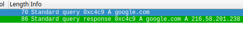

default route, NAT/PAT, brandvägg, rootservrar, TLD-servrar och auktoritativa namnservrar(allt syns inte i fångsten). Detta brukar vara den naturlig vägen för namnuppslag, vägen som kan observeras i pcapfilen är endast en kort kommunikation mellan klient och dns-resolver, men en hel del händer som inte syns.

## Protokollinventering

### DNS

Namnet "Google.com" kollas upp med hjälp av nslookup, och genererar query and response trafik. Dock stötte jag på motgånger i just genereringen av denna trafik, åtminstone mot alldagliga sidor som Google,Facebook,Youtube...etc.
för att undvika lösa dns mot ovanliga domäner så undersökte jag problemet, det framgick att min lokala dns-resolver har cachat dessa domäner och genom att återställa cachen så kunde dns-queries skickas genom min gateway mod dns-servrar, och på så vis generera trafiken

`sudo resolvectl flush-caches`

genom att fånga trafiken i det mometet kan vi undersöka dns paketet mer noggrant.

_Här ser vi dns-upplösningar för både A och AAAA-poster_

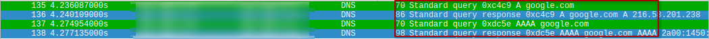

skildnaden mellan A och AAAA-poster är att A-poster används för att matcha värdnamn som motsvarar IPv4-adresser och AAAA för IPv6-adresser.

Genom att gräva lite djupara kan vi se

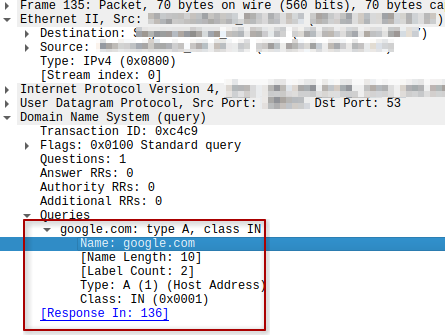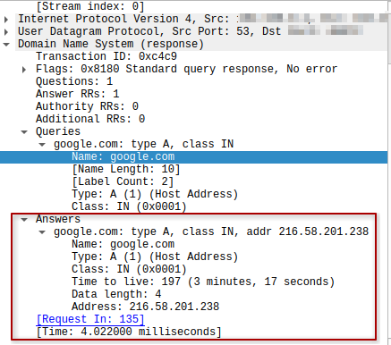

Svaren visar att förfrågan på dns lösning kom till dns-servern och att domänen kunde översättas från domännamn till IP-adress, Google.com ---> 216.58.201.238. Det som inte är säkert i denna trasktion är om servern eller webbtjänsten är tillgänglig, dns ger oss endast adress inte information om det finns en väg dit.

### ICMP
ICMP(Internet Control Message Protocol) är ett stöd protokoll, det används av nätverksenheter som routrar för att skicka driftinformation eller eventuella felmedelanden som ska ge indikation på framgång eller misslyckanden.

Med kommandot ping kan man enkelt köra echo request/reply response för att ta reda på tillgänglighet.

_Här kan vi se en enkel request/reply kedja från källa till destination_
 

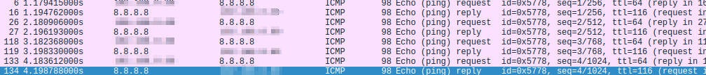

genom att köra dess request/reply kedjorna mot klienter/webbservrar kan man ta reda på responstid och om anslutning, dock så blockar vissar servrar pingförfrågningar, och bara för att servern svarar så betyder det inta att tjänsten som webbservern erbjuder fungerar.

### TCP
TCP(Transmission Control Protocol) är vad som används när stabilitet och pålitlighet är i fokus, t.ex vid hämtning av en webbsida.
En TCP-koppling sker i 3 steg, ett så kallat "3-way handshake".

_Paket vy för en sådan "handshake"_
 

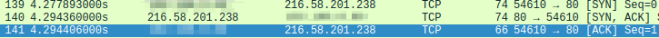

Klienten och server skickar dessa paket mot varandra för att etablera en stabil uppkoppling, 

SYN -> SYN-ACK -> ACK 

_Portar_
 

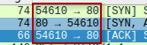

Här ser man att kommunikationen som sker under denna hanskakning sker mellan klienten på port 54610 och port 80 på servern, alltså mellan [Min IP-adress]:54610 <--> 216.58.201.238:80.

### HTTP
HTTP(Hyper Text Transfer Protocol) är en av kärn protokollen på internet, protokollet definerar hur datan ska överföras mellan klienter, servrar och webbtjänster. och tillskildnat från TLS/HTTPS krypterar inte datan och bör endast användas för allmän och intetsägande data.

HTTP verkar på en Request-Response cykel mellan klient och server 

_Klient skickar en GET-Request_

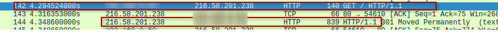

_Och server svarar_

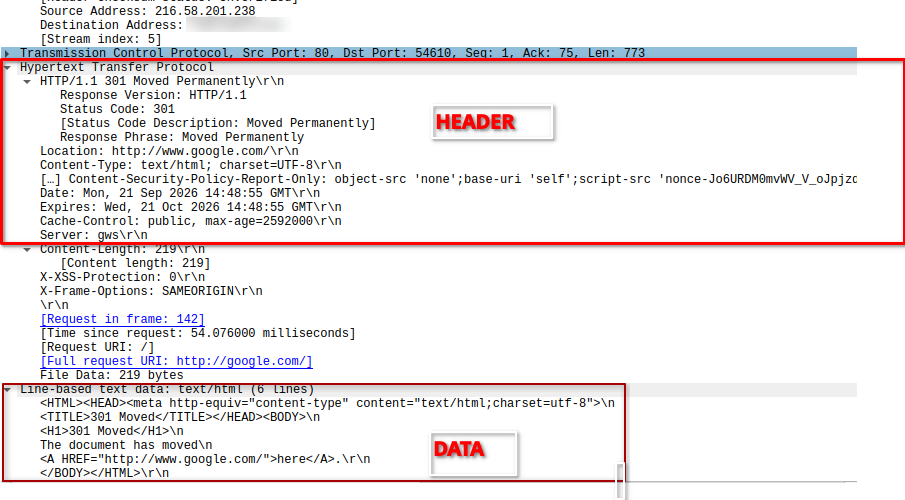

I denna test runda kördes endas curl mot google på port 80 som är används för http trafik, 
svaret är i klartext, både datan och header, och kan avläsas av vem som helst som sitter på nätverket, skulle sidan ha en form för exempelvis användarnamn och lösenord  som man fyllt i hade den informationen varit synlig här.

### TLS/HTTPS

TLS/HTTPS är protokollet som majoriteten av internet använder idag när det gäller transport av känslig eller hemlig data, och är väsentlig gällande personlig integritet och upprätthållning av standarder och lagar. TLS/HTTPS använder sig av "Diffie-Hellman key exchange" speciellt i den senara versionen (TLS 1.3)

_Illustration av TLS 1.3 in action._

_packet pane vy av föregående illustration._

_Hur datan ser ut över nätet_

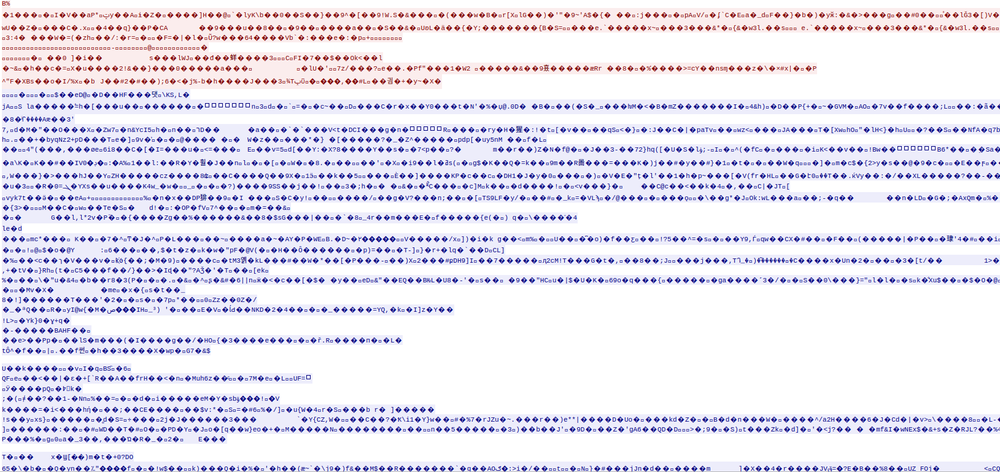

Allt som har med applikationdata, headers eller annan metadata är helt krypterade, den ända informationen som går över nätet i "klartext" är relaterad till SSL-konfigurationen och DH-nyckelutbytet.

_exempel på okrypterad data_

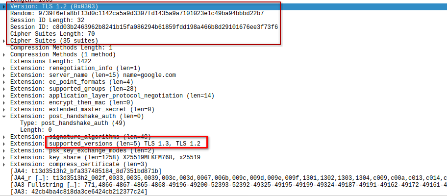

Det som visas här är en klient som ansluter till google.com, föreslår TLS 1.3 (och TLS 1.2-alternativ), annonserar krypteringsmetoder och nyckelutbytesalgoritmer som stöds, och startar processen att skapa en krypterad HTTPS-session.

## fördjupad analys av två flöden

`curl -m 5 -sS -o /dev/null "$http://google.com"`
_detta kommando ska enligt förväntan generera ett flöde bestående av TCP-handskakning och en http GET-förfrågan, ett svar, och en avslutning på anslutningen_

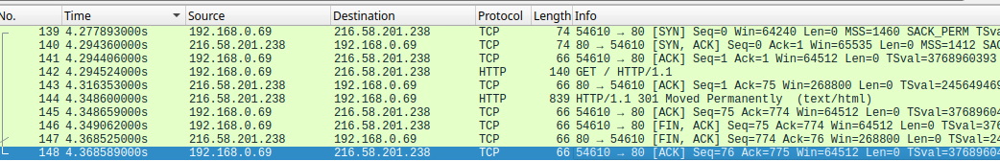

Vi ser ett tydligt flöde i info kolummen

| Flagga | källa | dest | port | protokoll | förklaring |
|--------|--------|--------|--------|--------|--------|
| SYN | Klient | Server | 54610 » 80 | TCP | Initierar en TCP anslutning, skickar ISN |
| SYN-ACK | Server | Klient |80 » 54610 | TCP | Bekräftar klientens ISN, skickar egen ISN |
| ACK |  Klient | Server | 54610 » 80 | TCP | Bekräftar mottagen ISN, etablerar uppkoppling, data kan nu transporteras
| PSH, ACK | Klient | Server | 54610 » 80 | HTTP | Klient skickar en HTTP GET request |
| ACK | Server | Klient | 80 » 54610 | TCP | Server bekräftar förfrågan 
| PSH, ACK | Server | Klient | 80 » 54610 | HTTP | Server svarar på förfrågan med data i form av html text
| ACK | Klient | Server | 54610 » 80 | TCP | Klienten bekräftar serverns svar
| FIN, ACK | Klient | Server | 54610 » 80 | TCP | Förbereder terminering av anslutning |
| FIN, ACK | Server | Klient | 80 » 54610 | TCP | Server skickar FIN,ACK för att avsluta anslutningen på sin sida
| ACK | Klient | Server | 54610 » 80 | TCP | Bekräfar serverns FIN och avlslutar anslutningen helt.

### Etablering av TCP-anslutning 
#### paket 139-141
En TCP-anslutning börjar alltid med en trevägs handkskakning, där klienten skickar SYN-paket och server svarar med SYN-ACK, vilket både bekräftar att servern mottog klientens förfrågan och att servern bekräftade med ett eget paket, efter en sista runda av bekräftning så är anslutningen mellan server och klient öppen och kommunikation kan börja. och detta kan vi observera genom paketpanelen i wireshark. 
### Överföring av HTML över HTTP
#### paket 142-144
Flödet mellan klient och server gällande HTTP-trafik börjar med en GET-förfrågan från klient till server, som sedan svaras med en bekräftelse på mottagning, sen ett paket senare: datan som var efterfrågad. och det vi ser när vi kör curl mot en http adress är just den trafiken, i den ordningen. Vi ser även i paketpanelen att vi får tillbaka ett status medelande "301 Moved permanently" vilket är ett sätt säga att resurserna har flyttats, och pekar mot en https webadress i det här fallet.
### Avlutning av anslutning
#### paket 145-148
När kommunikationen är färdig så avslutas anslutningen genom TCP:s avslutningsprocess,Klienten skickar ett FIN, ACK-paket för att signalera att den inte längre har någon data att skicka. Servern bekräftar detta och skickar senare sitt eget FIN, ACK-paket för att avsluta sin del av kommunikationen. Slutligen skickar klienten ett ACK-paket, vilket innebär att anslutningen är helt avslutad.

##  krypterat och okrypterat

### Aspekt : Synlig metadata

#### HTTP
Det som skickas över ren http utan TLS är alltid synligt och kan inspekteras av vem som helst på nätverket.

#### TLS/HTTPS
Det som skickas med HTTPS/TLS blir för det mesta krypterat, förutom data som är harmlös som domänamn, IP-adresser och datamängd och timing

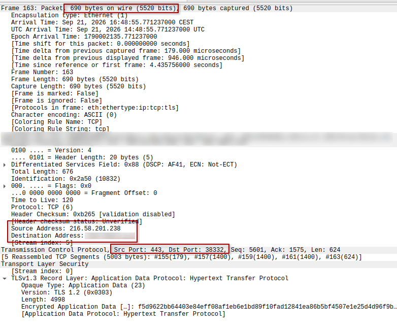

| Information | HTTP | HTTPS |
|--------|--------|--------|
|IP-adresser | Synlig | Synlig |
|Domännamn | Synlig | Synlig |
|URL-sökväg (/login) | Synlig | Dold |
|Query-parametrar | Synlig | Dold |
|Headers| Synlig | Dold |
|Cookies| Synlig | Dold |
|Formulärdata/lösenord| Synlig | Dold |
|Webbsidans innehåll| Synlig | Dold |
|Datamängd och timing| Synlig | Synlig |

## brandvägg och hardening 

Det observerade ICMP-flödet (exempelvis en pingförfrågan, Echo Request/Echo Reply) påverkas av brandväggsregler som tillåter eller blockerar ICMP-trafik. Om en extern värd skickar en ping till systemet berörs en inkommande regel som tillåter ICMP Echo Request. Om systemet själv skickar ping mot en annan värd berörs en utgående regel som tillåter ICMP-trafik.

Skillnaden mellan en lyssnande tjänst och brandväggstrafik

En tjänst som lyssnar lokalt innebär att ett program har öppnat en port och väntar på inkommande anslutningar. Exempelvis kan SSH-servern lyssna på TCP-port 22. Om tjänsten är åtkomlig utifrån.
beror helt på brandväggsregler.

Brandväggen fungerar som ett separat kontrollager. Även om en tjänst lyssnar kan brandväggen blockera all trafik till porten. Omvänt kan en brandväggsregel tillåta trafik till en viss port, men om ingen tjänst lyssnar på den porten kommer anslutningsförsöken ändå att misslyckas.

default deny innebär att all trafik blockeras som standard om den inte uttryckligen tillåts. Detta minskar attackytan eftersom oväntade eller oönskade anslutningar stoppas automatiskt.

Koppling till tidigare hardening:
De observerade tjänsterna och nätverksflödena bör stämma överens med de säkerhetsåtgärder som tidigare har genomförts. Om hardeningen syftade till att minska attackytan är det rimligt att endast nödvändiga tjänster är aktiva och att endast förväntad trafik förekommer. 
- SSH som lyssnar lokalt på port 22.
- Utgående DNS-trafik för namnuppslagning.
- ICMP för felsökning och nätverifiering.
- Etablerade anslutningar till betrodda tjänster.
# CIA och evidens
## Konfidentialitet
PCAP-filer samlar in omfattande nätverkstraffik, det kan inkludera känslig och personlig data som inloggningsuppgifter, personuppgifter och andra detaljer, är det så att man har samlat trafik med okrypterade webbsider som http istället för https/tls så är det ännu viktigare att nogrant sanera pcap-filen då den informationen är i klartext.
en sanerad PCAP-fil bör ej innehålla identifierbara detaljer om dig, din dator eller din nätverkskonfiguratiton, och byt ut dem mot generiska ersättningar.

## Integritet

En sanerad PCAP inkluderas i rapporten för att möjliggöra verifiering och reproducerbar analys utan att exponera känslig information.

Tydliga och konsekventa filnamn gör materialet lättare att identifiera, förstå och hantera för alla som arbetar med det.

Paketnummer hjälper till att beskriva i vilken ordning paket mottagits, vilket underlättar exakta referenser under analysen.

Genom att jämföra en PCAP-fil mot dess originalhash kan man verifiera att filen är oförändrad och att dess integritet har bevarats.

Under commit-processen kan filnamn och hashvärden inkluderas i commit-meddelandet för att stärka spårbarheten och knyta analysen till ett specifikt Git-commit-ID.

Kombinationen av filnamn, hashvärden, paketnummer och versionshantering bidrar till en tydlig och verifierbar kedja av digital bevishantering.

## Tillgänglighet

### dns

Namnuppslagning kan bekräftas på två sätt, antingen genom att följa dns anropet från wireshark och säkerställa att det besvaras med en IP-adress, eller enkelt söka på domänen med en webbläsare och observera om du blir ledd till rätt ställe.

Det händer ibland att dns-uppslag inte skickas eller misslyckas, och det kan antyda att antingen dns-svar cachas av datorn och inte skickar ut fler anrop mot dns servern, eller att det det är något fel på din dns konfigurationen, båda felen kan inte påvisas på verktyget men måste istället lösas genom att antingen rensa cachen, eller t.ex säkerställa att brandväggen tillåter ingående/utgående trafik på port 53 (dns porten), fungerar inte det bör du undersöka själva nätverket.

### Route
En enkel observation för att säkerställa route är att analysera vilken trafik som helst som går utåt, utan en route har din dator ingen chans att nå någon externt nätverk. Genom att observera exempelvis icmp trafik, lämpligtvis genom att testa icmp mot ett säkert demostrationmål som googles dns server på 8.8.8.8.

### transport

Exempel på lyckad trasnport kan vara tcp traffik där klient anropar en server och efterfrågar html-data, genom att köra curl mot ett säkert mål, exempelvis _http://google.com_, så kan GET requests observeras i wireshark eller tcpdump, ett lyckat anrop besvaras med läsbar applikationsdata  där html i klartext kan examineras, detta antyder till att klientens anrop mot servern var lyckad och data har trasporterats över näten fullständigt.

# Slutsats

Olika typer av nätverkstrafik genererades med hjälp av ett trafikmixskript riktat mot säkra demonstrationsmål för att skapa ett varierat analysunderlag.

DNS-, HTTP- och TCP-trafik analyserades särskilt ingående eftersom dessa protokoll tydligast illustrerar kommunikationsflöden och nätverksbeteenden.

Oklart:

Det finns vissa osäkerheter. Paketfångsten visar endast den trafik som passerade det observerade gränssnittet under inspelningsperioden. Händelser utanför fångsten, exempelvis kommunikation mellan DNS-resolvern och externa namnservrar, går inte att verifiera direkt.

Kommunikation över HTTP utan TLS bör undvikas eftersom innehållet kan avlyssnas och manipuleras. Endast nödvändig trafik bör tillåtas genom brandväggen.

Nästa steg hade varit:

Testfall skulle kunna genomföras mot portar utan aktiva tjänster för att dokumentera misslyckade anslutningsförsök och visa hur dessa skiljer sig från framgångsrik kommunikation.
Exempel på okrypterad HTTP-trafik inkluderades för att demonstrera riskerna med att överföra data utan HTTPS och betydelsen av transportkryptering.