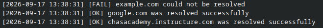
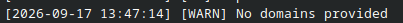
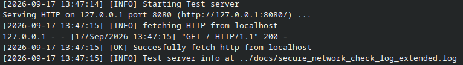
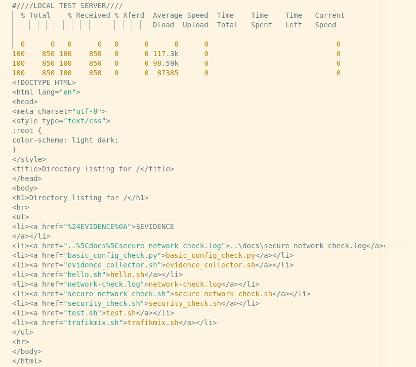
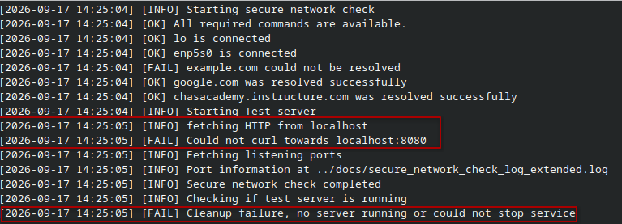
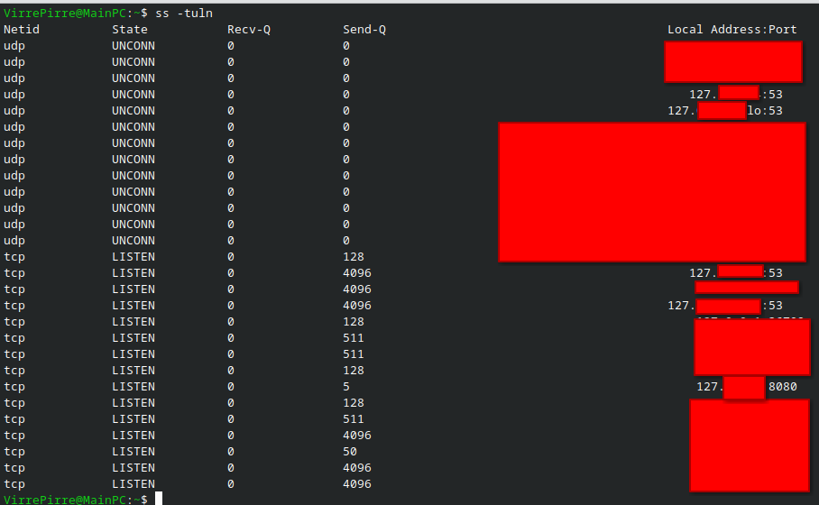

## week 3 Secure networck check

- Miljö : Lokal linux : Fedora : 7.1.13-200.fc44.x86_64 

### Nätverksinterface:
-  lo : Loopback, datorns interna kommunikation
- enp5s0 : bunden kommunikation mellan pc och gateway 

- Privat IP pekar till klienter i ett LAN nätverk.
- Local Adress kallas också localhost och är maskinen själv och används ofta för testing av en service localt.
- Publik IP är en gemensam address för alla klienter i ett LAN som används för kommunikation över WAN/Internet.

### Utmaning/Begränsningar
Lärande miljön använder en annan distribution och kan visa avvikelser i output eller tillgängligheten av verktyg. Men jag tror inte dessa avvikelser kommer orsaka större problem, då det finns substaniell documentation och verktyg.

5.

| Kontrollområde | Exempel | Förklara |
|---|---|---|
| Interface och IP |  | visar två nätvärkgränssnitt, localhost och enp5s0 som är kopplingen mellan maskin och nätverk. |
| Routing |  | standard vägen är 192.168.0.1 vilket i det här fallet är routen. |
| DNS|  | dig är ett sätt att få dns information för en specifik domän, DNS är ett system för göra sökningen enklare, DNS översätter domännamn till IP adresser.  |
|Portar & Tjänster|  | port 53 lyssnar här på localhost, vilket är del av systemd-resolved vilket cachar IP adresser till servrar. |
| Lokal tjänst| se bevis i secure_network_check_extended.log | curl mot localhost ger endast resultat om något servar något från localhost.  |
| Process eller systemstatus| | ssytemctl visar att firewalld är aktiv och körs. Firewalld är ett verktyg för brandväggshantering.|

## Skildnader / Begränsningar

- lokal maskin behöver inte använda ssh
- Kör Fedora linux istället för Ubuntu
- tillgång till samma verktyg men olika package-managers
- inga märkbara begränsningar som gjort arbetet svårare eller enklare.

## Testning

### normalfall/felfall 1

Domännamn inkluderade med ett felfall:
Förväntat resultat är att kontrollen körs och kan översätta domännamn till IP-adresser.

i fallet åvan ser vi dock bara att 2/3 domänamn kunde lösas, det som har hänt här är att DNS är rätt konfigurerad för google och chasacademy, men inte för example.com. 
Example.com kan då inte nås med den aktuella konfigurationen, eller så är domänen felaktig.

Inga domännamn angivna, i detta felfall har listan med domäner blivit tömd så kontrollen har inget att testa

Det som händer är att kontrollen ser att den är tom och avbryter tidigt med en varning status och fortsätter utan att krascha.

### normalfall 2
  
Lokal testtjänst svarar: förväntat resultat är att server svarar med http, och program fortsätter

Data från test tjänsten tas emot och förvaras i evidens loggen

### felfall 2

Försöker köra curl mot localhost:8080 är inte möjligt för ingen tjänst lyssnar
inget svar förväntas.

programmet körs och fel medelanden dykerupp, programmet fortsätter, dokumenterar fel och kraschar inte.

## Koppling till vecka 36

## Hardening
### jämför lyssnande portar och tjänster med vad du förväntar dig efter genomförd hardening. Motivera minst en tjänst som behöver finnas kvar.

systemd-resolved (DNS): aktiv och förväntad.
Eventuella övriga tjänster som lokal hostad http server förväntas under kontroll.

SSH-tjänsten behövs inte finnas kvar eftersom den används för fjärradministration av system, felsökning och underhåll utförs lokalt på maskinen, men kan vara praktiskt och i vissa miljöer nödvändigt.

Om några oväntade portar eller tjänster hade varit aktiva skulle dessa undersökas vidare och vid behov stängas av för att minska attackytan. Resultatet visar att de lyssnande portarna överensstämmer med den förväntade konfigurationen efter hardening och att inga onödiga tjänster är aktiva.

##  Backup och recovery
### förklara vilka två nätverkskontroller i ditt verktyg som du skulle köra först efter en återställning och vad de verifierar. Ingen ny restore krävs.
Jag skulle först kolla routing och nätverksgränssnitt, för att se om maskinen kan nå default gateway/LAN
Jag skulle också säkerställa att DNS kan lösa enkla domännamn, detta visar om systemtet har problem med domännamn översättning.

## CIA-analys

### Konfidentialitet: Vilka uppgifter i nätverksutdata kan vara känsliga, och hur sanerar du dem? 
Skriptet skriver inte ut någon data till terminalen överhuvudtaget, dock så skrivs mer känslig information till en loggfil där utdata från t.ex "ss -tuln" och "ip -br a"
skrivs, denna data saneras med regex matchning där IP-adresser och lyssnande portar döljs,

### Integritet: Hur hjälper loggar, versionshistorik, tydliga statusar och kontroller till att skapa tillit till resultatet?
Loggar dokumenterar vilka kontroller som gjorts, när dem gjordes och om dem var lyckade eller inte, en systemadministratör kan snabbt granska och verifiera att tester blev genomförda.

Version historik sparar alla förändringar som skriptet har genomgått och det bidrar till ökad tilit, man kan se när och vad som ändrades samt vem. 

Tydliga statusar på kontroller gör återigen att en systemadministratör kan snabbt undersöka felen eller varningarna som uppstår vid en kontroll. 
### Tillgänglighet: Hur visar DNS, route, tjänst och port om en funktion är tillgänglig?
DNS visar om domännamn kan översättas eller ej, misslyckas DNS så betyder det att den tjänsten inte kan nås  via domännamnet även om tjänsten i sig fungerar.

Route visar om det finss en väg för trafiken att ta för att kommunicera över samma eller andra nätverk, tillexempel en felkonfigurerad route kommer inte kunna skicka trafik till rätt destination. 

En tjänst måste vara aktiv för att kunna leverera, om en tjänst ligger nere spelar det ingen roll om DNS kan översätta domännamnet eller inte. Du hittade butiken, men den är stängd. I skriptet görs detta genom att starta en lokal webbserver och ansluta till den via localhost.

Om en tjänst lyssnar på en port som klienter inte förväntar sig, så är tjänsten inte tillgänglig, även om tjänsten är igång. En tjänst måste lyssna på rätt port och klienten måste veta vilken för att kommunikationen ska vara möjlig.

### Avvägning: Ge ett exempel där en säkerhetsåtgärd kan försämra tillgänglighet om den konfigureras fel.
En enkel säkerhetsåtgärd som ofta görs är att konfigurera brandväggen, lätt hänt att man konfigurerar fel, och det kan leda till att t.ex portar blir stängda, IP-adresser blir blockerade och trafik från nätverk a som var menad för en tjänst på nätverk b droppas,  detta är något som enkelt kan skada tillgängligheten.

## reflektion och förbättring
### Vilken kontroll gav mest värde och varför?
DNS är otroligt väsentlig för kommunikation i ett WAN som internet, att snabbt kunna kontrollera ett par domäner och se dem går att översätta eller ej är bland det snabbaste sätten att göra nätverksfelsökning.
### Vilken miljöskillnad påverkade ditt arbete?
Eftersom jag har jobbat med en lokal linux maskin så har jag inte behövt använda SSH eller SCP för anslutning eller fildelning, allt har gått otroligt smidigt och enkelt för den delen. Men jag tror det finns många fördelar med köra med molntjänster som OCI och Google cloud, jag saknar förmågan att göra systembackups, och enkel distrobution byte, för kontrollera att skript är så distribution agnostiskt som möjligt.
### Vilket fel var svårast att tolka?
Det svåraste problemet jag hade att tolka var DNS-testerna, eftersom 2/3 tester fungerade så var det svårt att avgöra om problemet låg i DNS konfigurationen eller om den specifika domänen, men efter ytterligare kontroller kan jag bestämt säga att DNS-funktionen fungerar överlag.
### Vad skulle du förbättra i en version 2?
Jag skulle villja förbättra min terminal och log output, städa upp den och göra snyggare, och göra den mer distro/miljö agnostisk.
### Hur kan verktyget användas i en verklig drift- eller säkerhetsprocess utan att bli riskabelt?
I verklig drift kan den användas för att kontrollera att ett nytt/återskapat system kan lösa DNS requests,har bunden/obunden uppkoppling, samt få överblick om den har någrå portar som lyssnar.

## AI Redovisning
Ingen generativ Ai har används till störreutsträckning, utan vid ett tillfälle hade jag problem med kod som inte kompilerade, och visade sig att jag saknade ett "done" i en for-loop.
