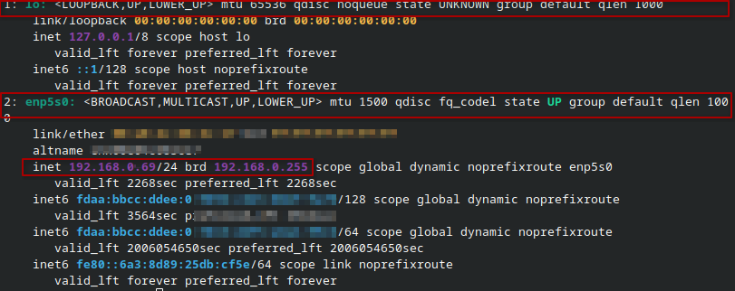
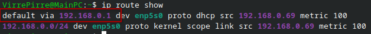
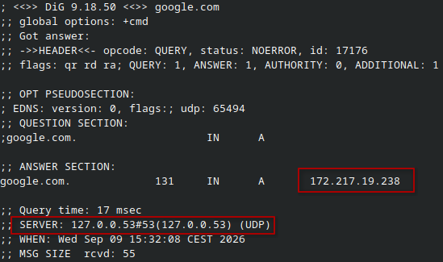
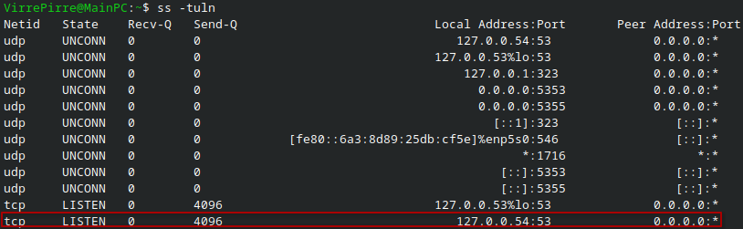
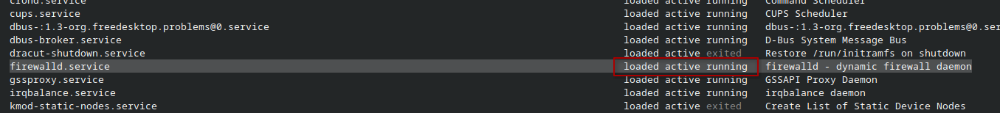
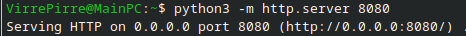
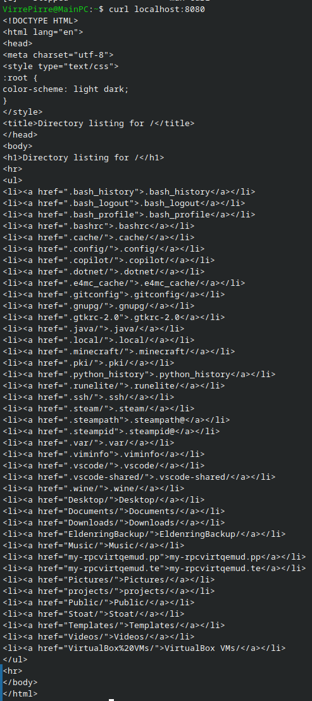

## week 3 Secure networck check

- Miljö : Lokal linux : Fedora : 7.1.13-200.fc44.x86_64 

- Nätverksinterface: lo | enp5s0

- Privat IP pekar till klienter i ett LAN nätverk.
- Local Adress kallas också localhost och är maskinen själv och används ofta för testing av en service localt.
- Publik IP är en gemensam address för alla klienter i ett LAN som används för kommunikation över WAN/Internet.

### Utmaning/Begränsningar
Lärande miljön använder en annan distribution och kan visa avvikelser i output eller tillgängligheten av verktyg. Men jag tror inte dessa avvikelser kommer orsaka större problem, då det finns substaniell documentation och verktyg.

5.

| Kontrollområde | Exempel | Förklara |
|---|---|---|
| Interface och IP |  | visar två nätvärkgränssnitt, localhost och enp5s0 som är kopplingen mellan maskin och nätverk. |
| Routing |  | standard vägen är 192.168.0.1 vilket i det här fallet är routen. |
| DNS|  | dig är ett sätt att få dns information för en specifik domän, DNS är ett system för göra sökningen enklare, DNS översätter domännamn till IP adresser.  |
|Portar & Tjänster|  | port 53 lyssnar här på localhost, vilket är del av systemd-resolved vilket cachar IP adresser till servrar. |
| Lokal tjänst| se bild 1-2 | curl mot localhost ger endast resultat om något servar något från localhost.  |
| Process eller systemstatus| | ssytemctl visar att firewalld är aktiv och körs. Firewalld är ett verktyg för brandväggshantering.|

 image 1 

  
~                                                                         

 image 2 

  
