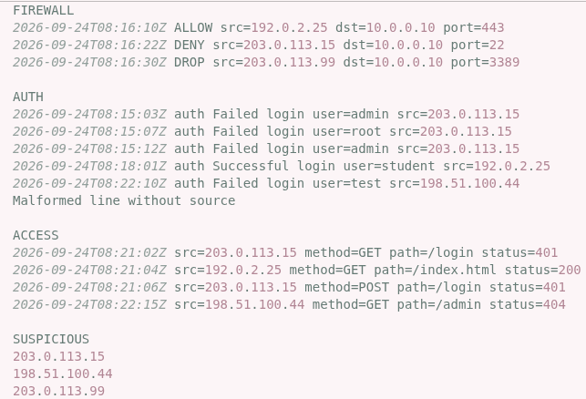
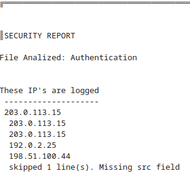
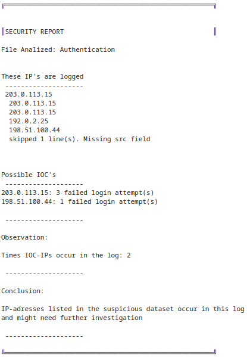

### Syfte
Syftet Med programmet är att få en överblick på loggar där misstänksamma IP-addresser har gjort försök mot en server.

### Data set
Basic SOC dataset for ITSX26 week39.

### Kör instruktioner
Programmet använder relativa filvägar, vilket innebär att strukturen är viktigt

så länge strukturen ser ut så här och dataset-namnen är oförändrade
och kör programmet från src katalogen
`path_to_project/project/src/./security_report.py`
så körs programmet som förväntat.

_fil struktur:_
+ Project
  + src
    + security_report.py
  + data
    + dataset files go here
  + output
    + security_report.txt

### Python version:
Python 3.13.15

### Begränsningar 

Programmet som det står nu kollar inte efter om Misstänkta IP-addresser lyckades logga in, kom igenom brandväggen, eller  om dem lyckades hämta data från server. 

Programmet kollar endast om det har varit försök och loggar misslyckanden

som det står nu måste alla  tre datasetfiler finnas i katalogen "data" (auth,access, och firewall.log) som begränsar vilka typer av loggar som kan testas, så programmet är inte avsedd för en godtycklig mängd logfiler.

### Testning

#### Testfall : saknar src

I auth saknas fältet "src"

förväntat resultat:

`skipped 1 line, missing source`

faktiskt resultat:
_Raporterar 1 line utan source som förväntat._

#### Testfall: IOC-matchning finns
Testar mot auth.log

##### Förväntat resultat:
`4 failed login attempts,  from "203.0.113.15" and "198.51.100.44" `

##### Faktiskt resultat

_Visar totalt 4 matchningar från rätt addresser._

