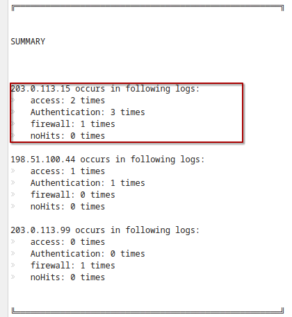

# Analys

### Rådata

Raport programmet nyttjar alla tillgängliga enkla data-sets
- access.log
- auth.log
- firewall.log
- suspicious_ips.txt
  
Logfilerna analyeras av programmet och loggar rader där det förekommer Misslyckade åtkomst försök, och om dessa rader innehåller IP-adresser som matchar addresser som markerats som misstänksamma.

Dessutom används ett ytterliggare ligfil som demonstrerar när det inte förekommer misstänksamma händelser

- no_hits.log

### Observation

Programmet matchar misstänksamma källor mot fält i loggarna där ett misslyckat försök har gjorts och räknar hur många försök som gjordes från den källan.
Under sammanfattningen så beskrivs vilka filer som varje misstänksamt markerad IP-address kan finnas.

### Slutsats

Från det man kan Observera från rapporten som genererats, är att källaddresser som har markerats som misstänksamma förekommer i en eller fler logfiler.

Rapporten kan användas för att identifiera mönster och uppmärksamma misstänksamma händelser,
rapporten bör dock användas som underlag för vidare manual analys snarare än en färdig rapport 

### Osäkerhet

Datan i setsen kan inte användas som grund till säkerslutsats, eller bevis på att en hotaktör har försökt göra intrång, utan mönstrerna som blir analyserade kan endast ge misstanke om ett försök, det är inte ett bevis på ond avsikt.

Rapporten som genereras av programmet garanterar inte att ett intrång har eller inte skett eller att diverse misslyckanden är av antagonistisk bakrund.
Exempelvis diverse misslyckade försök kan tyda på:

- Felangivet lösenord
- kopplad till fel nätverk
- användning av fel port

Detaljer i den genererade rapporten gällande intrångsförsöken är också väldigt vaga, gällande bl.a port som blev provad eller vilken användare som aktören försökte logga in som blir höljd i mystik, och lyckade försök från misstänksamma IP-addresser loggas inte direkt utan måste härledas från listan av loggade IP-addresser.

Datan i setsen kan inte heller användas som grund till säker slutsats, eller bevis på att en hotaktör har försökt göra intrång, utan mönstrerna som blir analyserade kan endast ge misstanke om ett försök, det är inte ett bevis på ond avsikt.

Ett exempel där fortsatt analys kan vara avsevärd är där ett mönster uppstår.

_Ett mönster av upprepade misslyckade försök_

Här ser vi att en källa som markerat som misstänksam har gjort flera försök mot ett nätverk, här skulle det vara förmånligt att utföra vidare anyls av trafiken, och undersöka detaljer som inte framträder i den genererade rapporten för en bättre uppfattning av vad aktören försöker göra.

Ett mönster är underlag för vidare analys inte bevis på avsikt.
