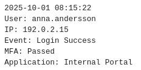
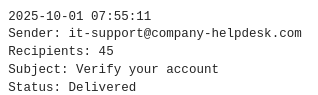
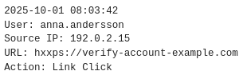

# Raport
## Avgränsning

## Executive summary
En kommunal förvaltning har mottagit ett flertal mejl från en källa som utger sig för att vara från den interna IT-avdelningen, i mejlet uppmanas användare att klicka på en länk och sedan logga in för att behålla åtkomsträttigheter till ett intern system.
Mejlen anses vara välformulerad och trovärdig. Misstanke om phishing uppstår efter att en användare klickar på länken, men att  inga uppgifter blev utlämnade,
För närvarande är avsikten med mejlet inte bekräftat och om AI har använts eller ej, men eftersom en användare har interagerat med länken kan man inte utesluta möjligheten att  avsikten med länken kan ha varit ond.
Händelsen får då en hotnivå av medelhöga, då man inte vet om ett intrång har skett eller ej.
Rekommendation är att organisationen följer CIS åtgärder som  loggranskning, framtida utbildning om risken av phishing-mejl skrivet av AI för att förebygga framtida incidenter, och att introducera MFA för alla konton på förvaltningen.

### Fakta och antaganden
***Givna fakta***
#### 1.

Samma email har mottagits av flera medarbetare på förvaltningen, men endast en medarbetare har interagerat med länken som funnits i mejlet.

#### 2.

Avsädaren antog identiteten på den interna IT-supporten, och ansågs vara välskrivet och trovärdigt

#### 3.
Ingen bekräftad incident har uppstått, och medarbetaren som interagerade med länken angav aldrig några uppgifter om kontot
 

  
***Antaganden:***
#### 1.
Mejlet kan vara ett phishing försök i mål att tjäla inloggningsuppgifter, och mejlet kan vara genererat av AI

#### 2.
Avsändaren är i verkliga fall en okänk illvillig aktör

#### 3.
Möjlighet för okänt intrång, möjligt att i samband med att medarbetaren klickade på länken kan man ha hämtat hem något utan att veta.

 
  
***Behöver verifieras:***

Om intrång i självaste verket har skett och om mejlet i frågan
var från en säker och känd aktör (IT-support)

***Avgränsning***
Denna analys omfattar endast händelsekedjan som uppstår från och med mejlen kommer in till förslagen åtgärd.
Analysen bygger bara på antaganden och är inte en analys om faktiska intrång, stulna lösenord, eller data läckor, utan hur man möjligtvis kan motarbeta  framtida incidenter.
### Tillgångar & händelsekedja

#### Tillgångar:
- Användarnamn:
- Lösenord
- Epostsystem
- Internt system
#### Händelsekedja:
- potentiell angripare skickar falska mejl
- Medarbetare öppnar mejl
- En medarbetare klickar på länken
- Länken diregerar till en sida som ser legitim ut.
- Inga uppgifter utlämnas och organisationen börjar undersöka
### CIA & Risk bedömning
#### Confidentiality:
Risk att användar uppgifter exponeras som kan leda till exponering av ännu kännsliggare data om en oaktoriserad aktör kan logga in.
#### Integrity
Skulle en hotaktör få tag på användaruppgifter, så ger dom möjlighet att potentiellt manipulera eller skada data, och beroende på vilka uppgifter som blivit komprimerade kan rättigheterna och risknivån variera.
#### Availablity
Manipulerad eller förstörd data som är väsentlig för verksamhetsdriften, 
kan leda till att arbetet tar längre tid eller inte kan göras alls.  
### CIS-mappning & Åtgärder

#### CIS 6: Access Controll Management:
CIS 6 leder till förstärkt försvar mot stulna uppgifer, genom att tilldela specifika rättigheter minimerar vi attackytan för en potentiell hotaktör,
En incident som hade kunnat vara katastrofal blir istället ett mildare störningsmoment.

**Prioriterad Åtgärd:**

Implementering av MFA leder till ett ännu robustare försvar mot stulna uppgifter, vilket betyder att även om en medarbetare uppger sina konto uppgifter som användarnamn och lösenord så kan en hotaktör fortfarande logga in.

**Verifiering**

Verifiera att MFA är aktivt för användar konton genom att genomföra
enkla testinloggningar, samt granskning av autentiseringsloggar.

#### CIS 8: Audit Log Management

CIS 8 handlar om att samla information om händelser, för att kunna förstå och ge underlag för hur man ska möta problem.

**Prioriterad Åtgärd:**

Genom att logga events som email-händelser och inloggningar får vi potentiellt upplysning av allvarlighetsgraden av intrång, och vilket konto som möjligvis blivit komprimerat och underlag för hur man ska agera. 

**Verifiering**

Efter ha etablerat ett loggsystem, kan man utöva några testfall för att se att all fungerar, det verifieras det genom att granska bl.a autentisering och epost-loggar för att säkerställa att all registreras korrekt,
och att man kan spåra till specifika användare och tidpunkter.

#### CIS 14: Security Awareness and Skill Training

Genom att ge personal en grund för hur man upptäcker och minimerar chansen för utsättas för phishing-attacker, minimerar man risken för incidenter i framtiden.
Det kan exempelvis göras genom att skapa och upprätthålla strikta rutiner, exempelvis att vara mer skeptisk av likvärdiga mejl i framtiden.

**Prioriterad Åtgärd:**

Genom att ta ytterliggare säkerhetsåtgärder genom att upprätthålla rutinerliga
rollanpassade program för att öka personalens säkerhetsmedvetenhet gällande olika risker, speciellt faran med phishing.

**Verifiering**

En utbildning är alltid bra, men för att säkerställa att den har haft effekt kan det vara fördelsaktigt att göra uppföljning genom att testa deras kunskaper med testfall, exempelvis genom att skicka ett ofarligt mejl från okända källor, och med hjälp av CIS 8 så kan man överse loggar, och se om någon felat genom att klicka på något som dem inte ska klicka på.

### CIS Summary

Genom att implementera dessa CIS åtgärder så stärker det försvaret och gör att framtida försök mot en organisation blir  mindre attraktiva för angripare.

### Teknisk koppling

Tidigare delar av kursen har varit fokuserade mot trafikanalys och loggskapande, och knyter ihop bra med denna uppgift, särskilt när det gäller kontrollering av loggar.
Efter att i caset implementerat CSI 8, så är det svårt att inte tänka på arbetet i föregående uppgift, där en genererad loggfil ger översikt över händelser mot en server, och hur en sådan rapport kan ett konkret underlag för inriktade trafik analyser. 

### AI & källredovisning

Under denna uppgift har AI använts sparsamt och endast i mån där jag sakande rätt formulering av det jag redan hade själv skrivit.

Resultated av användingen blev en marginalt klarare text som är mer passande för nivån jag vill nå. 

**övriga källor:**

[www.cisecurity.org/controlls/cis-con](https://www.cisecurity.org/controls/cis-controls-list)

### Slutsats

Efter allt är sagt och gjort så finns det ingen all-lösning när det kommer till cybersäkerhet, alla steg vi tar mot säkra våra servrar, konton och enheter är endast en hinderbana för illvilliga aktörer.

Men gör vi hinderbanan tillräckligt omfattande och komplicerad så är förhoppningen att det ska demotivera dem och sätta sitt sikte någon annanstans.

Den undersökta händelsen bedöms som möjlig phising attack riktad mot kommunens medarbetare, även om ingen bekräftad incident har uppstått så har en medarbetare interagerat med länken vilktet är ett starkt motiv till att fortsatt undersökning och analys.

Den största kvarvarande osäkerheten är att det saknas bekräftad information om vad som skedde efter medarbetarens interaktion med länken, vi vet inte om länken var farlig eller om det faktiskt var ett mejl från det interna IT-teamet, eller om AI användes för att skapa det. vilket jag tycker visar vikten i att vara extra kritisk mot emails, och andra medelanden från källor som framträder att vara t.ex medarbetare, AI idag är advancerad nog idag då det är otroligt svårt at se skildnad på text skrivet av en människa och en av AI.